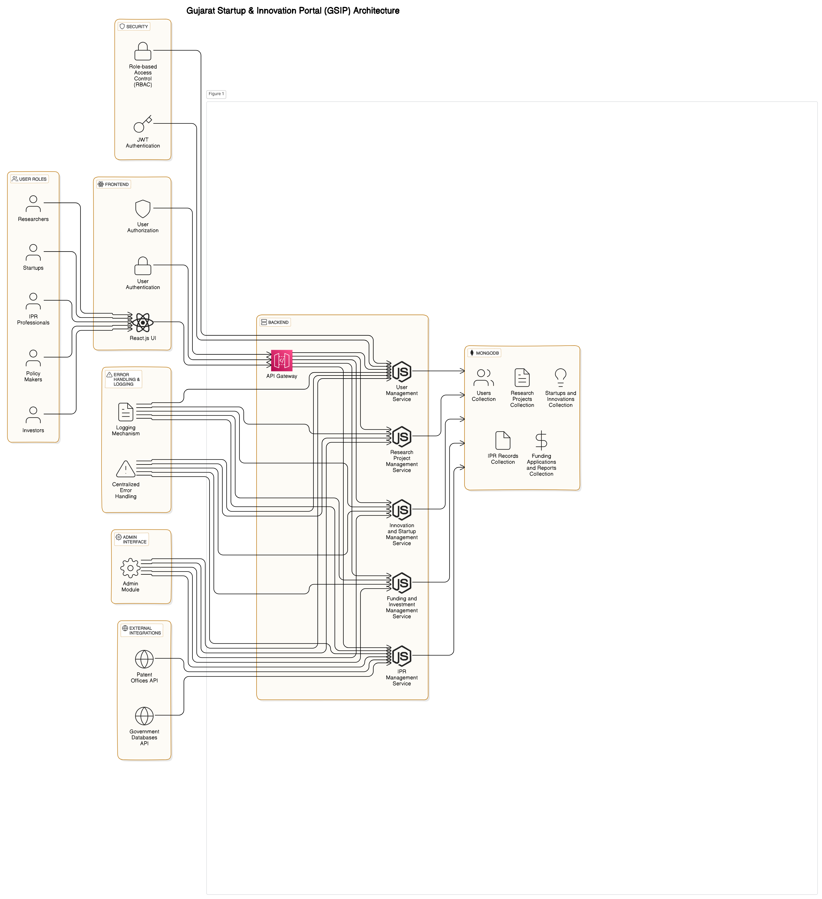
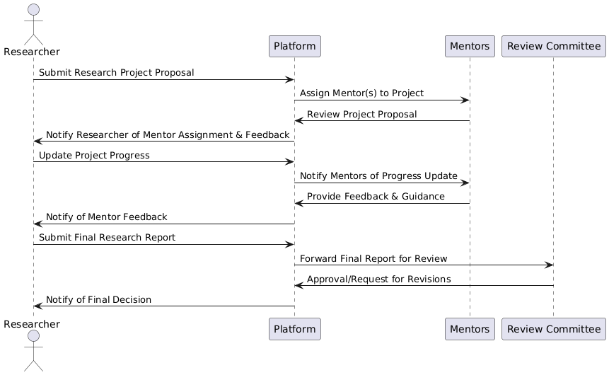
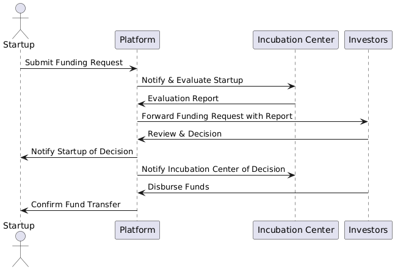
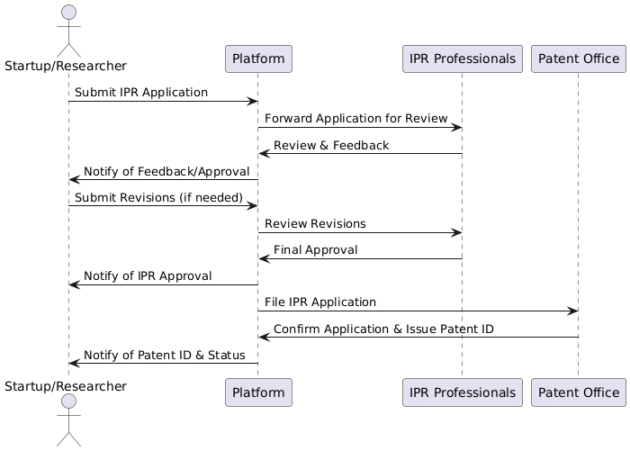

# 📊 Gujarat Startups & Innovation Platform (GSIP) - System Diagrams

Welcome to the **Gujarat Startups & Innovation Platform (GSIP)** project documentation. This repository includes visual representations of the platform's architecture and processes to help you understand how the system operates.

---

## 🌐 System Architecture Diagram

The System Architecture Diagram provides an overview of the entire platform's structure, showing how different components and services interact with each other.

*Figure 1: System Architecture Diagram*

---

## 🔄 Sequence Diagrams

### **Scenario: Research Project Submission and Funding Request**

**Description:**

1. **Researchers & Academics** submit a research project proposal.
2. **System** processes the proposal and notifies relevant stakeholders.
3. **Investors** review the proposal.
4. **Mentors** provide feedback.
5. **Incubation Centers** offer support.
6. **IPR Professionals** manage any related intellectual property rights.
7. **System** updates the project status and sends notifications.

*Figure 6: Research Project Submission and Funding Request Sequence Diagram*

### **Scenario: Funding Request from a Startup**

**Description:**

1. **Startups** submit a funding request.
2. **System** processes the request and notifies relevant stakeholders.
3. **Investors** review and decide on the funding.
4. **Incubation Centers** provide additional resources or support.
5. **System** updates the funding status and sends notifications.

*Figure 7: Funding Request Sequence Diagram*

### **Scenario: IPR Management**

**Description:**

1. **Researchers & Academics** or **Startups** submit an IPR application.
2. **System** processes the application.
3. **IPR Professionals** review and manage the application.
4. **System** updates the status and notifies the applicant.

*Figure 8: IPR Management Sequence Diagram*

---

## 🎨 Additional Diagrams

As the project evolves, additional diagrams and visual aids will be added here to provide a comprehensive view of the system's design and functionality.

---

Feel free to navigate through these diagrams to get a better understanding of the GSIP platform's architecture and processes. If you have any questions or need further details, please reach out to the development team @ krishnarothe103@gmail.com or pateldhruvin452@gmail.com 

---

